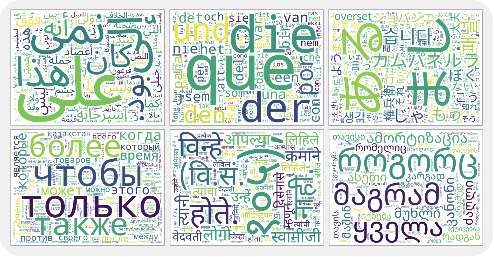
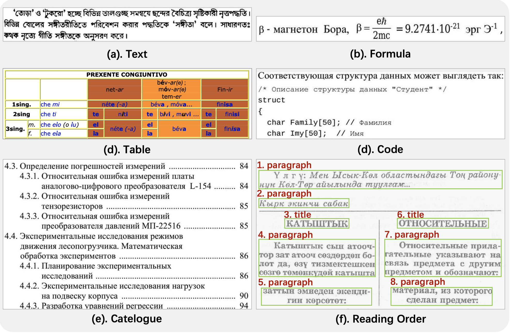

<h1 align="center">MORE: A <u><strong>M</strong></u>ultilingual D<u><strong>o</strong></u>cument Pa<u><strong>r</strong></u>sing B<u><strong>e</strong></u>nchmark and Evaluation</h1>

<p align="center">
  <a href="https://openreview.net/pdf?id=ov240fehF6"></a>
  <a href="https://huggingface.co/datasets/zimoqingfeng/MORE"></a>
  
  
  
</p>

<p align="center">
  <a href="#overview">🌍 Overview</a> |
  <a href="#benchmark-snapshot">📊 Benchmark</a> |
  <a href="#data-construction">🧱 Data</a> |
  <a href="#quick-start">🚀 Quick Start</a> |
  <a href="#data-format">🗂️ Data Format</a> |
  <a href="#evaluation">🧪 Evaluation</a> |
  <a href="#leaderboard">🏆 Leaderboard</a>
</p>

<a id="overview"></a>

## 🌍 Overview

**MORE** is a large-scale benchmark for multilingual document parsing. It evaluates whether OCR and document parsing systems can recover not only plain text, but also formulas, tables, code blocks, catalogs, and reading order across a broad set of languages and scripts.

The name stands for **M**ultilingual D**o**cument Pa**r**sing B**e**nchmark. MORE targets the evaluation blind spot created by document parsers that claim broad multilingual support while most public benchmarks still focus on high-resource languages such as English and Chinese.

The benchmark is designed around three goals:

- **🌐 Language coverage:** 149 languages spanning six major script families.
- **🧩 Structural coverage:** text, formulas, tables, code, catalogs, and reading order are evaluated as separate tasks.
- **📚 Authentic data:** samples are curated from real-world documents with a model-assisted and human-refined annotation pipeline.

The camera-ready paper describes a stratified 1,237-page real-document sample during data collection, and reports 1,288 images in the benchmark statistics table. The current annotations include 8,221 text samples, 82 formulas, 94 tables, 73 code blocks, 104 catalogs, and 1,072 reading-order samples.

<a id="benchmark-snapshot"></a>

## 📊 Benchmark Snapshot

### ✅ Task Coverage

| Dataset | Languages | Images | Text | Formula | Table | Code | Catalog | Reading Order | Open Source |
| --- | ---: | ---: | :---: | :---: | :---: | :---: | :---: | :---: | :---: |
| OmniDocBench | 2 | 1,200 | &#10004; | &#10004; | &#10004; | - | - | &#10004; | &#10004; |
| ICDAR RRC-MLT | 6 | 1,800 | &#10004; | - | - | - | - | - | &#10004; |
| CC-OCR | 10 | 1,500 | &#10004; | - | - | - | - | - | &#10004; |
| Mistral-OCR | 11 | - | &#10004; | - | - | - | - | - | - |
| MDPBench | 17 | 3,400 | &#10004; | &#10004; | &#10004; | - | - | &#10004; | &#10004; |
| XDocParse | 126 | - | &#10004; | &#10004; | &#10004; | - | - | &#10004; | - |
| **MORE** | **149** | **1,288** | **&#10004;** | **&#10004;** | **&#10004;** | **&#10004;** | **&#10004;** | **&#10004;** | **&#10004;** |

### 🧾 Annotation Statistics

| Dataset | Images | Languages | Text | Formula | Table | Code | Catalog | Reading Order | Open Source |
| --- | ---: | ---: | ---: | ---: | ---: | ---: | ---: | ---: | :---: |
| ICDAR RRC-MLT 2017 | 1,800 | 6 | 1,800 | - | - | - | - | - | &#10004; |
| CC-OCR | 1,500 | 10 | 1,500 | - | - | - | - | - | &#10004; |
| Mistral-OCR | - | 11 | - | - | - | - | - | - | - |
| XDocParse | - | 126 | - | - | - | - | - | - | - |
| **MORE** | **1,288** | **149** | **8,221** | **82** | **94** | **73** | **104** | **1,072** | **&#10004;** |

<a id="data-construction"></a>

## 🧱 Data Construction

MORE is curated from real-world PDFs rather than synthetic pages.

**Construction pipeline:**

1. 🌐 Crawl more than 20 million PDFs from diverse web sources.
2. 🧹 Filter low-quality documents with spam, broken-encoding, and layout-density heuristics.
3. 🏷️ Classify languages, remove Chinese, English, and unlabeled documents to prioritize under-represented languages, leaving roughly 5.7 million candidate documents.
4. ⚖️ Stratify by language, selecting up to 10 PDFs per language and one random page per PDF.
5. ✍️ Annotate layout, reading order, and element content through a model-assisted, human-refined process.

**Language coverage:** MORE is intentionally broad rather than concentrated in a few high-resource scripts. It covers 149 languages across six major script families; non-Latin scripts account for **46.31%** of the benchmark.

| Script Family | # Languages | Share |
| --- | ---: | ---: |
| Latin | 80 | 53.69% |
| Cyrillic | 26 | 17.45% |
| Sanskrit | 20 | 13.42% |
| Arabic | 11 | 7.38% |
| Chinese | 4 | 2.68% |
| Other | 8 | 5.37% |

<div align="center">
  <p><strong>Word clouds across six major script families</strong></p>
  
</div>

The word clouds summarize frequent tokens across the major script families, offering a quick visual sense of MORE's multilingual content diversity beyond the numeric language counts.

**Annotation workflow:** Page-wise structure annotation verifies layout boxes and reading-order links. Element-wise content annotation aggregates predictions from multiple OCR/VLM systems, then human experts adopt exact matches, refine errors, and discard ambiguous cases.

<a id="quick-start"></a>

## 🚀 Quick Start

### 1. Create Environment and Install Python Dependencies

```bash
conda create -n more python=3.10
conda activate more
pip install -r requirements.txt
```

### 2. Install CDM System Dependencies

MORE follows the OmniDocBench v1.5 evaluation protocol and uses CDM for formula recognition. CDM renders LaTeX before matching visual characters, so formula evaluation requires Ghostscript, TeX Live, and Node.js.

Install Ghostscript and TeX Live:

```bash
sudo apt-get update
sudo apt-get install -y ghostscript texlive-full wget
```

Install Node.js 16.x:

```bash
tmp_dir=$(mktemp -d)
cd "$tmp_dir"
wget https://registry.npmmirror.com/-/binary/node/latest-v16.x/node-v16.13.1-linux-x64.tar.gz
tar -xvf node-v16.13.1-linux-x64.tar.gz
sudo mkdir -p /usr/local/nodejs
sudo cp -r node-v16.13.1-linux-x64/* /usr/local/nodejs/
sudo ln -sf /usr/local/nodejs/bin/node /usr/local/bin/node
sudo ln -sf /usr/local/nodejs/bin/npm /usr/local/bin/npm
cd -
```

Check the required commands:

```bash
gs --version
pdflatex --version
node -v
npm -v
```

### 3. Run the Evaluation

Run any config with:

```bash
mkdir -p result
python pdf_validation.py --config <config_path>
```

The repository also includes a small `md2md` demo with paired ground-truth and prediction Markdown files:

```bash
python pdf_validation.py --config configs/md2md.yaml
```

The runner writes detailed outputs to `result/`, including per-task matched samples, per-page edit-distance files, CDM artifacts, TEDS scores, and the final metric summary.

<details>
<summary>View common output files</summary>

```text
result/
  pred_quick_match_metric_result.json
  pred_quick_match_text_block_result.json
  pred_quick_match_display_formula_result.json
  pred_quick_match_table_result.json
  pred_quick_match_reading_order_result.json
```

</details>

If you only want a lightweight text-style smoke test, create a local config from the recognition example below and point it at one of the files under `demo_data/recognition/`.

<a id="data-format"></a>

## 🗂️ Data Format

MORE supports two common evaluation formats.

### 🧾 Single-module Recognition JSON

The current single-module loader expects ground truth and prediction fields in the same JSON file. Each item contains `layout_dets`, and every layout item stores the target value plus a prediction field, usually named `pred`.

<details>
<summary>View recognition JSON example</summary>

```json
[
  {
    "layout_dets": [
      {
        "category_type": "text_block",
        "text": "ground-truth text",
        "pred": "model prediction",
        "attribute": {
          "text_language": "text_english"
        }
      }
    ],
    "page_info": {
      "image_path": "sample.jpg",
      "page_attribute": {}
    },
    "extra": {}
  }
]
```

</details>

Use these ground-truth keys for the provided demos:

| Task | Demo File | Ground-truth Key | Prediction Key | Normalization |
| --- | --- | --- | --- | --- |
| Text | `demo_data/recognition/MORE_demo_paragraph.json` | `text` | `pred` | `text` |
| Code | `demo_data/recognition/MORE_demo_code.json` | `text` | `pred` | `text` |
| Catalog | `demo_data/recognition/MORE_demo_catalog.json` | `text` | `pred` | `text` |
| Formula | `demo_data/recognition/MORE_demo_formula.json` | `latex` | `pred` | `formula` |
| Table | `demo_data/recognition/MORE_demo_table.json` | `html` | `pred` | `table` |

<details>
<summary>View recognition config example</summary>

```yaml
recogition_eval:
  metrics:
    - Edit_dist
  dataset:
    dataset_name: omnidocbench_single_module_dataset
    ground_truth:
      data_path: ./demo_data/recognition/MORE_demo_paragraph.json
      data_key: text
    prediction:
      data_key: pred
    category_type: text
```

</details>

> Note: `recogition_eval` is intentionally spelled this way to match the current task registry.

### 📝 Markdown-to-Markdown Evaluation

For full-page parsing, put matching `.md` files in ground-truth and prediction folders:

```text
demo_data/md2md/
  gt/
    sample_001.md
  pred/
    sample_001.md
```

`md2md_dataset` extracts and matches:

- text blocks
- isolated formulas written with `$$...$$`, `$...$`, `\[...\]`, or `\(...\)`
- HTML tables and LaTeX tables
- reading order from the matched element positions

<details>
<summary>View Markdown-to-Markdown config example</summary>

```yaml
end2end_eval:
  metrics:
    text_block:
      metric:
        - Edit_dist
    display_formula:
      metric:
        - Edit_dist
        - CDM
    table:
      metric:
        - TEDS
        - Edit_dist
    reading_order:
      metric:
        - Edit_dist
  dataset:
    dataset_name: md2md_dataset
    ground_truth:
      data_path: ./demo_data/md2md/gt
    prediction:
      data_path: ./demo_data/md2md/pred
    match_method: quick_match
```

</details>

Available `match_method` values are `quick_match`, `simple_match`, and `no_split`.

### 🎯 Expected Model Outputs

The camera-ready evaluation uses task-specific output formats so different model families can be compared fairly.

| Task | Expected Output |
| --- | --- |
| Text / Catalog | Plain extracted text. |
| Code | Markdown code block. |
| Formula | LaTeX expression. |
| Table | HTML table. |
| End-to-end parsing | Markdown body content in reading order, with tables represented as HTML and formulas represented as LaTeX. Headers and footers are ignored. |

<a id="evaluation"></a>

## 🧪 Evaluation

Run any config with:

```bash
mkdir -p result
python pdf_validation.py --config <config_path>
```

<div align="center">
  
</div>

### 📐 Metrics

MORE follows the OmniDocBench v1.5 evaluation protocol and extends it to code and catalog evaluation. The final benchmark score is decoupled across tasks so one stage does not silently propagate errors into another.

| Task | Metric | Config Example | Notes |
| --- | --- | --- | --- |
| Text | NED | `configs/ocr.yaml` | Raw runner output is `Edit_dist`; leaderboard reports `1 - Edit_dist`. |
| Code | NED | custom recognition config | Same JSON shape as text, with code-specific content. |
| Catalog | NED | custom recognition config | Same JSON shape as text. |
| Reading Order | NED | `configs/md2md.yaml` | Computed from matched element order. |
| Formula | CDM | `configs/formula_recognition.yaml` | Requires LaTeX, Ghostscript, and Node.js. |
| Table | TEDS | `configs/table_recognition.yaml` | Evaluates HTML tree similarity. |

Sequential tasks use normalized edit distance:

```math
\begin{aligned}
\mathrm{NED}
&= 1 - \frac{1}{N} \sum_{i=1}^{N}
\frac{\mathrm{EditDist}(P_i, G_i)}
{\max(\lvert P_i\rvert, \lvert G_i\rvert)}
\end{aligned}
```

Formula recognition uses Character Detection Matching:

```math
\begin{aligned}
\mathrm{CDM}
&= \frac{1}{N} \sum_{i=1}^{N}
\frac{2 \cdot TP_i}{2 \cdot TP_i + FP_i + FN_i}
\end{aligned}
```

Table recognition uses TEDS:

```math
\begin{aligned}
\mathrm{TEDS}
&= 1 - \frac{1}{N} \sum_{i=1}^{N}
\frac{\mathrm{TreeEditDist}(T_{p,i}, T_{g,i})}
{\max(\lvert T_{p,i}\rvert, \lvert T_{g,i}\rvert)}
\end{aligned}
```

The overall score is the arithmetic mean of the six task scores:

```math
\begin{aligned}
\mathrm{Overall}
&= \frac{1}{6}
\left(
\mathrm{TEDS}
+ \mathrm{CDM}
+ \sum_{k \in \mathcal{S}} \mathrm{NED}_k
\right)
\end{aligned}
```

<a id="leaderboard"></a>

## 🏆 Leaderboard

Scores are reported as percentages. Higher is better. The table below lists task-wise averages from the camera-ready paper; page-wise averages are reported in the paper appendix.

| Model | Size | Overall ↑ | Text NED ↑ | Formula CDM ↑ | Table TEDS ↑ | Code NED ↑ | Catalog NED ↑ | Read Order NED ↑ |
| --- | ---: | ---: | ---: | ---: | ---: | ---: | ---: | ---: |
| HunyuanOCR | 1B | **92.42** | 93.81 | **93.28** | <ins>78.56</ins> | **97.07** | **95.36** | <ins>96.45</ins> |
| Gemini 3 | - | <ins>91.61</ins> | **95.39** | 90.27 | **81.02** | 93.05 | <ins>94.31</ins> | 95.63 |
| PaddleOCR-VL | 0.9B | 87.96 | 90.99 | <ins>91.11</ins> | 61.11 | <ins>96.29</ins> | 93.04 | 95.19 |
| dots.ocr | 3B | 84.31 | <ins>94.45</ins> | 90.77 | 39.81 | 95.38 | 88.26 | **97.18** |
| Qwen2.5-VL | 3B | 83.93 | 89.36 | 84.48 | 68.27 | 86.69 | 92.54 | 82.23 |
| Qwen3-VL | 2B | 83.56 | 92.02 | 65.45 | 65.21 | 92.38 | 93.76 | 92.53 |
| DeepSeekOCR | 3B-A570M | 82.91 | 85.27 | 75.67 | 61.63 | 92.26 | 88.26 | 94.36 |
| MinerU2.5 | 1.2B | 48.85 | 27.12 | 73.29 | 33.83 | 72.41 | 21.61 | 64.81 |

Key observations from the paper:

- 🥇 HunyuanOCR achieves the best overall score and leads formula, code, and catalog recognition.
- 🔎 Gemini 3 is strongest on text and table recognition, while dots.ocr leads reading order.
- 🧱 Table parsing remains the largest structural bottleneck; text, code, and catalog recognition are much closer to saturation for the strongest models.
- 🌏 Non-Latin scripts account for 46.31% of MORE, making long-tail script robustness a central part of the benchmark rather than an appendix-only concern.

## 🧭 Repository Layout

```text
MORE/
  assets/                 README figures
  configs/                evaluation configs
  dataset/                dataset loaders
  demo_data/              small recognition and md2md demos
  metrics/                Edit distance, TEDS, CDM, and reporting utilities
  registry/               task, dataset, and metric registries
  task/                   evaluation task wrappers
  tools/                  visualization, conversion, and model inference scripts
  utils/                  matching, extraction, normalization, and IO helpers
  pdf_validation.py       config-driven evaluation entry point
```

The scripts under `tools/model_infer/` are adapters for generating predictions from OCR or document parsing models. They are not called automatically by `pdf_validation.py`; run or adapt them first, then evaluate the generated predictions with a config file.

## 🩺 Troubleshooting

- `FileNotFoundError` under `result/`: create the output directory with `mkdir -p result` before running the evaluator.
- `Cannot find pred for ...`: make sure prediction filenames match the ground-truth filenames for `md2md`, or that every JSON layout item has the configured prediction key.
- CDM or LaTeX rendering errors: confirm that Ghostscript, TeX Live, and Node.js are available in the active environment.
- Empty or surprising recognition scores: check `ground_truth.data_key`, `prediction.data_key`, `category_filter`, and `category_type` in the config.

## 🙏 Acknowledgement

- [OmniDocBench v1.5](https://github.com/opendatalab/OmniDocBench/tree/v1_5) for the document parsing evaluation protocol and implementation reference.
- [CDM](https://github.com/opendatalab/OmniDocBench/tree/main/metrics/cdm) for formula recognition evaluation.
- [PubTabNet](https://github.com/ibm-aur-nlp/PubTabNet) for the TEDS table evaluation metric.
- We thank the open-source OCR and document parsing community for the models, tools, and shared practices that support multilingual baseline evaluation.
- We are deeply grateful to the annotators and reviewers whose meticulous verification of multilingual layouts, reading order, and element-level transcriptions forms the foundation of MORE's reliability.

## ⚖️ Copyright Statement

MORE includes materials derived from collected document resources and community contributions. We have made reasonable efforts to exclude materials that should not be redistributed. The released data and evaluation resources are intended for academic research and benchmark evaluation only, and should not be used for commercial purposes. If you are a rights holder and have concerns about any included content, please contact [bing-hong.wu@foxmail.com](mailto:bing-hong.wu@foxmail.com); we will review the request and take appropriate action.

## 📌 Citation

We sincerely hope MORE is useful for your research. If it helps your work, we would be grateful if you could cite our paper. Please replace the venue metadata with the official proceedings entry once it is available.

```bibtex
@inproceedings{xu2026more,
  title = {MORE: A Multilingual Document Parsing Benchmark and Evaluation},
  author = {Long Xu and Binghong Wu and Tinghao Yu and Hao Feng and Zhenyu Huang and Haoqing Jiang and Yunhao Wang and Shuo Huang and Feng Zhang},
  booktitle = {International Conference on Machine Learning},
  year = {2026}
}
```
